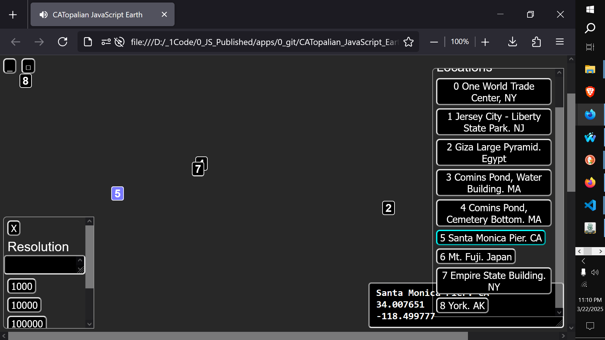

# CATopalian JavaScript Earth
A JavaScript application that allows the person to map the Earth with longitude and latitude and place markers with notes anywhere on the map.

USE APP: https://christopherandrewtopalian.github.io/CATopalian_JavaScript_Earth/CATopalian_JavaScript_Earth.html  

  

If you enjoy my apps and tutorials please consider buying me a coffee at paypal.me/keystonermarch

---

### How to Download this App
1. Click the green Code Button on this github page
2. Choose Download ZIP
3. Save the Zip File
4. Extract All
5. Double click the HTML file to start the App

---

Happy Scripting :-)